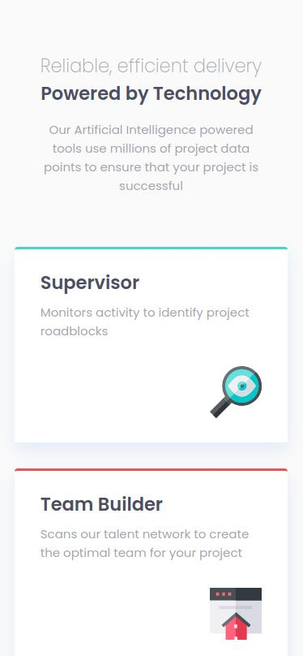
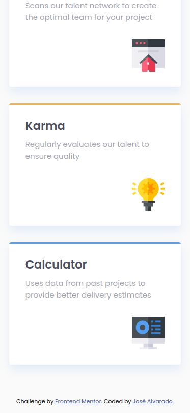
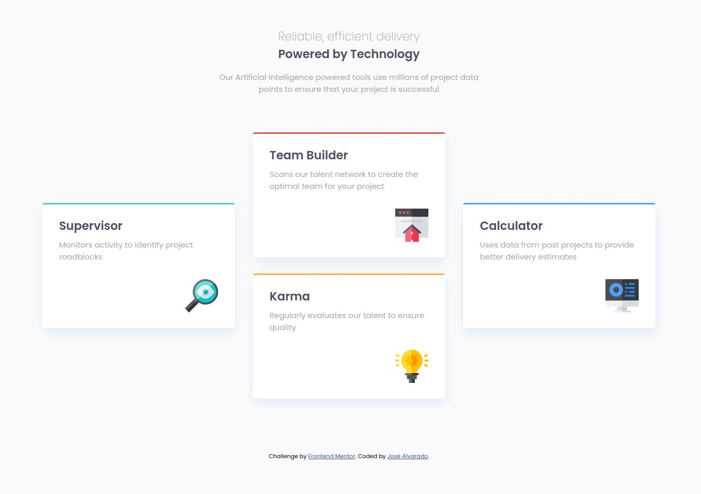

# Frontend Mentor - Four card feature section solution

This is a solution to the [Four card feature section challenge on Frontend Mentor](https://www.frontendmentor.io/challenges/four-card-feature-section-weK1eFYK). Frontend Mentor challenges help you improve your coding skills by building realistic projects.
## Table of contents

- [Frontend Mentor - Four card feature section solution](https://www.frontendmentor.io/challenges/four-card-feature-section-weK1eFYK)
- [Table of contents](#table-of-contents)
- [Overview](#overview)
- [Screenshot](#screenshot)
- [Links](#links)
- [My process](#my-process)
- [Built with](#built-with)
- [What I learned](#what-i-learned)
- [Continued development](#continued-development)
- [Author](#author)

## Overview

### Screenshot

### Links

- Solution URL: [https://fours-cards-feature-section.netlify.app/](https://fours-cards-feature-section.netlify.app/)
- Live Site URL: [https://fours-cards-feature-section.netlify.app/](https://fours-cards-feature-section.netlify.app/)

## My process

### Built with

- Semantic HTML5 markup
- CSS custom properties
- Flexbox
- CSS Grid
- Mobile-first workflow

### What I learned

With this project I was able to practice what I have learned about HTML and CSS, paying close attention to the semantics of HTML and Applying CSS Flexbox and Grid, as well as using CSS positioning.

### Continued development

One way to improve the project would be adding data dynamically, and maybe using some javascript framework like Vue, React, Angular or Svelte.

## Author

- Frontend Mentor - [@jrag-dev](https://www.frontendmentor.io/profile/jrag-dev)